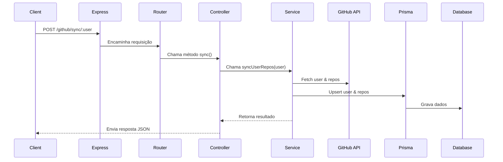

# Documento de Arquitetura: GitHub Sync API

Este documento descreve a arquitetura da aplicação **GitHub Sync API**, um serviço backend desenhado para sincronizar dados de utilizadores e repositórios do GitHub para uma base de dados local.

## 1. Estrutura de Pastas e Organização do Código

A estrutura do projeto foi organizada para promover uma clara separação de responsabilidades (Separation of Concerns), modularidade e escalabilidade.

```
/
├── prisma/                 # Configuração e migrações da base de dados com Prisma ORM.
│   ├── migrations/         # Ficheiros de migração SQL gerados pelo Prisma.
│   └── schema.prisma       # Definição do esquema da base de dados (modelos e relações).
├── spec/                   # Ficheiros de teste (atualmente com Jasmine, a ser migrado para Jest).
│   ├── controllers/        # Testes para os controladores.
│   ├── routes/             # Testes para as rotas.
│   └── services/           # Testes para os serviços.
├── src/                    # Código fonte da aplicação.
│   ├── controllers/        # Controladores: gerem a lógica de requisição/resposta HTTP.
│   ├── db/                 # Configuração e inicialização do cliente Prisma.
│   ├── lib/                # Funções de biblioteca ou wrappers de APIs externas (ex: GitHub API).
│   ├── routes/             # Definição das rotas da API e sua associação aos controladores.
│   ├── services/           # Serviços: contêm a lógica de negócio principal.
│   ├── app.ts              # Criação e configuração da instância da aplicação Express.
│   └── server.ts           # Ponto de entrada (entrypoint) do servidor HTTP.
├── .dockerignore           # Ficheiros a serem ignorados pelo Docker ao construir a imagem.
├── .gitignore              # Ficheiros a serem ignorados pelo Git.
├── Dockerfile              # Instruções para construir a imagem Docker da aplicação.
├── ARCHITECTURE.md         # Este documento.
├── docker-compose.yml      # Orquestração dos serviços (app e db) com Docker Compose.
├── package.json            # Definição do projeto, dependências e scripts.
└── tsconfig.json           # Configuração do compilador TypeScript.
```

## 2. Principais Componentes/Módulos

A aplicação segue uma arquitetura em camadas (layered architecture) para separar as preocupações.

- **`server.ts`**: Ponto de entrada que inicializa o servidor Express.
- **`app.ts`**: Cria e configura a aplicação Express, incluindo middlewares e rotas.
- **`src/routes/**`**: Define os endpoints da API e os mapeia para os controladores.
- **`src/controllers/**`**: Recebem as requisições HTTP, chamam os serviços e formatam as respostas.
- **`src/services/**`**: Contêm a lógica de negócio principal.
- **`src/lib/**`**: Abstrai a comunicação com APIs externas (neste caso, a API do GitHub).
- **`src/db/prisma.ts`**: Gere a conexão e o acesso à base de dados através do Prisma.

## 3. Fluxo de Dados e Comunicação

O fluxo de uma requisição é unidirecional: `Routes` -> `Controller` -> `Service` -> `Lib`/`DB`.

**Exemplo de Fluxo (`POST /github/sync/:user`):**



## 4. Dependências e Integrações

### Dependências de Produção:
- **`@prisma/client`**: ORM para interagir com a base de dados.
- **`axios`**: Cliente HTTP para aceder à API do GitHub.
- **`cors`**: Middleware para habilitar CORS.
- **`dotenv`**: Para gestão de variáveis de ambiente.
- **`express`**: Framework da aplicação.

### Dependências de Desenvolvimento:
- **`@types/*`**: Definições de tipo para TypeScript.
- **`jasmine`, `supertest`**: Ferramentas de teste.
- **`prisma`**: CLI do Prisma.
- **`ts-node`, `ts-node-dev`**: Para executar TypeScript sem compilação prévia.
- **`typescript`**: O compilador TypeScript.

## 5. Padrões de Design e Boas Práticas

- **Arquitetura em Camadas**: Separação clara de responsabilidades.
- **Injeção de Dependência (Conceptual)**: Serviços são instanciados nos controladores.
- **Singleton**: Instância única do cliente Prisma para otimizar conexões.
- **Variáveis de Ambiente**: Gestão segura de configurações com `dotenv`.